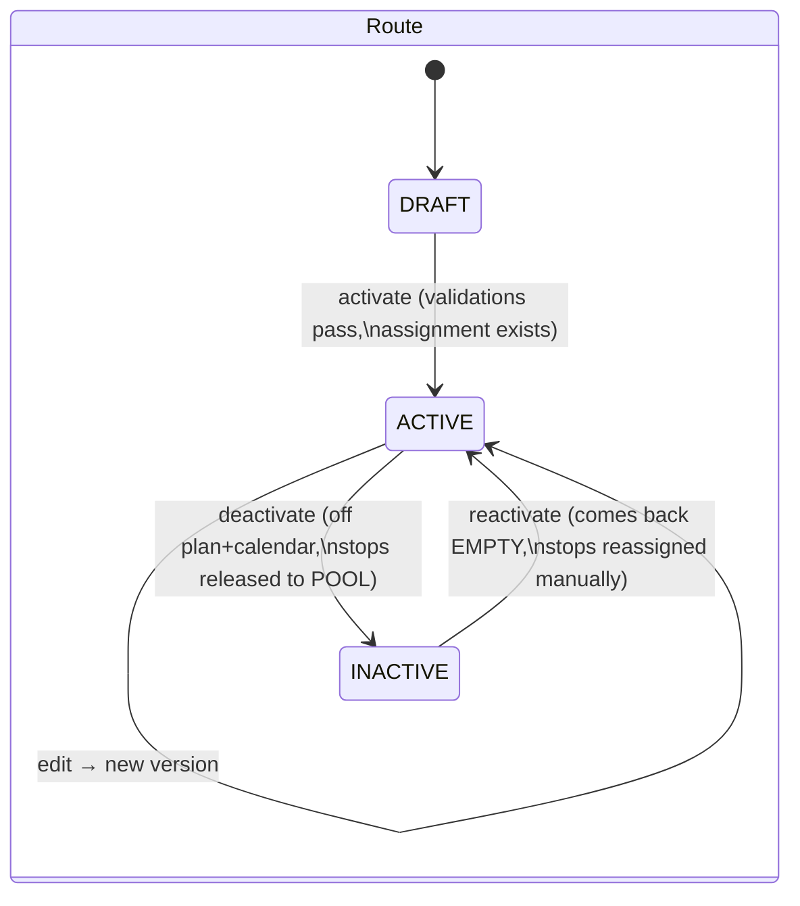
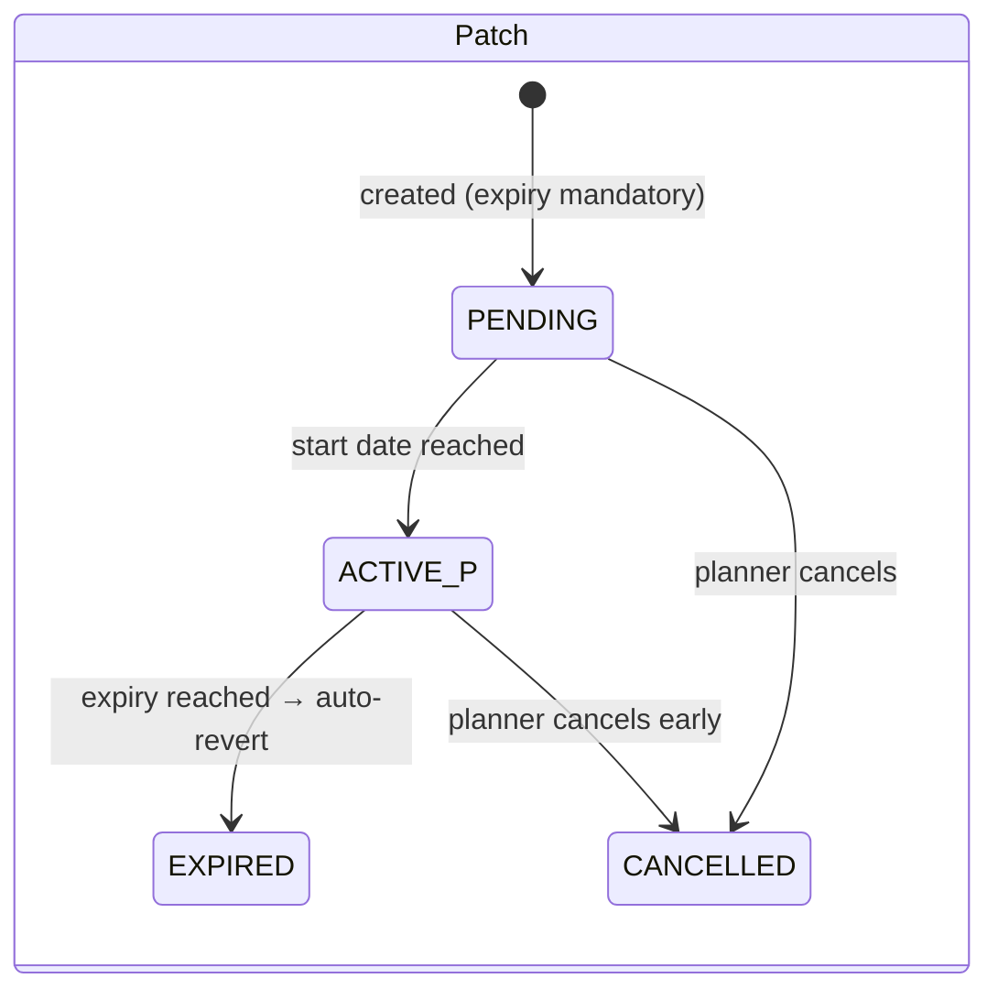
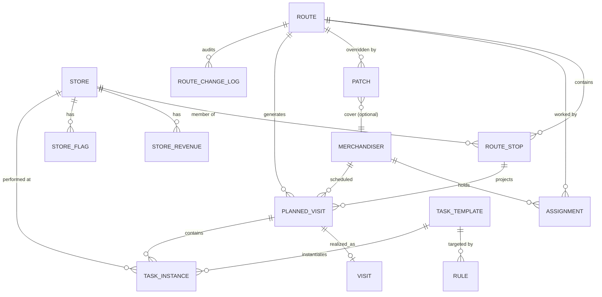
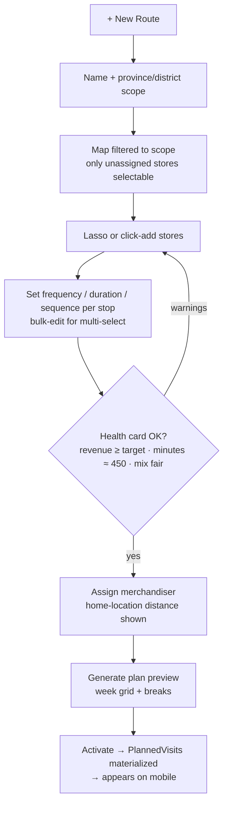

# EVO Route Planning — System Design

**Scope:** Route planning module only. No "koltuk" (seat) abstraction — routes are assigned **directly to merchandisers**, with full assignment history preserved so nothing the seat model provided (stability tracking, turnover metrics) is lost.

---

## 1. Core Concept Model

The system rests on **three elements**: the **Person** (merchandiser), the **Route** (where and when), and the **Tasks** (what is done at each stop). The old model chained four objects: `Seat → Route → Point List → Schedule`. The seat existed only to decouple "the job" from "the person". We get the same decoupling with simpler ideas:

1. **Route** = the *where/when*. A named, geographically-bounded, versioned collection of stops with visit frequencies. It exists independently of who works it.
2. **Assignment** = a dated link between a Route and a Merchandiser (*who*). Reassigning a person is one operation. The history of assignments *is* the old seat's audit value — turnover per route, mobbing signals — without the extra object.
3. **Tasks** = the *what*. Work items inside each visit (photo, SKT check, price collection, survey…), driven by templates and **rules** that adapt to the store (a Migros MM gets longer/more tasks than a 5M). Visit duration is the *sum of its tasks*, not a hand-typed number.

```
Store (master data + format: MM, 5M…)
  └── RouteStop (store's membership in a route: frequency, sequence)
        └── Route (geo boundary, revenue target, lifecycle)
              ├── Assignment (route ↔ merchandiser, dated, historical)
              ├── Patch (temporary override with expiry)
              └── PlannedVisit (materialized calendar)
                    └── TaskInstance (per-visit work items, durations
                        resolved by Rules, deadlines, overrides)
```

### Roles

Exactly two roles:

| Role | Capabilities |
|---|---|
| **Supervisor** | Full planning rights: routes, stops, patches, assignments, task templates, rules (including format-level rules), presets, settings, publishing. **Sees all regions** — no territorial permission scoping. Sees all analytics and live locations. |
| **Field agent** | Read-only view of their whole week (time-accurate). Receives change notifications. Can write **notes/messages** (anchored to a store, visit, or day — or general) as requests or context for the supervisor. No structural edits. |

### Key principles

- **Baseline + Patch, never mutate.** The monthly route is a stable baseline. All temporary changes (NATO summit, store ban, sick cover) are Patches with expiry dates. The effective schedule = baseline ⊕ active patches. When a patch expires, the system reverts automatically — no one "remembers to undo".
- **Operational vs commercial status.** A store not on any route is *unassigned*, not "passive". Store activation is derived from route membership — planners never toggle a passive/active flag manually. (Mete: "Passive is an operational status, not a commercial one.")
- **Geography is a constraint, not a suggestion.** Every route has a geographic scope (province → district → optional polygon). The picker physically cannot show out-of-scope stores.
- **One-step moves.** Moving a store between routes is a single "reassign" action; the system handles remove + add + schedule recalc atomically.
- **Validate at plan time, not at complaint time.** The 450-minute quota, revenue threshold, and store-mix fairness are checked live while the planner drags things around, not discovered later.

---

## 2. Entities & Domain Logic

### 2.1 Store (Point)

Master data synced from EVO sales — **including format, category, channel and coordinates**, so new stores arrive fully attributed and are routable immediately; no manual setup/triage step exists in this module.

| Attribute | Notes |
|---|---|
| `evo_store_id` | Unique ID from sales system — the sync key |
| name, chain, channel | National chain / local chain / other, from sales sync |
| province, district, neighborhood, lat/lng | Drives geo filtering and geofencing |
| `category` | `POTENTIAL` \| `HIGH_VALUE` \| `SERVICE` — drives color coding & fairness scoring |
| `format` | **Fixed global size scale, 6 levels** (code 1–6, labeled with Migros naming: Jet · M · MM · 3M · 4M · 5M), applied to every store regardless of chain — a large A101 can be "MM-sized". Primary input to task rules; rarely changes |
| `default_service_minutes` | Planner-set norm for this store |
| revenue snapshots | Last 6 months rolling, synced nightly from sales |
| flags | e.g. `banned_until` + reason (store manager refused service) |
| `active` | Active/inactive toggle (v0.4). **No delete/archive for stores either.** Deactivating drops the store from the plan + calendar but **keeps its route membership** — reactivating rebuilds its visits in that route. This is orthogonal to pool membership: *unassigning* a store to the pool (route → null) is a separate action from *deactivating* it. |

Derived: `assignment_status` = ON_ROUTE (exactly one active RouteStop) or UNASSIGNED. **A store can be on at most one active route** — enforced by the DB, which is what makes overlap errors impossible rather than merely discouraged.

### 2.2 Route

| Attribute | Notes |
|---|---|
| `route_code` | Permanent human-readable identity, e.g. `ANK-04`. Survives renames, versioning, and personnel changes — the handle used in reports, exports, and history ("what happened on ANK-04 last quarter?"). Identity = code; composition = version. |
| name, region | e.g. "Adana Merkez 2" |
| `geo_scope` | province + optional district list + optional drawn polygon (from lasso) |
| `revenue_target` | default 1,250,000 TL; per-route override allowed |
| `status` | `DRAFT` → `ACTIVE` ⇄ `INACTIVE`. **No delete, no archive** — the only lifecycle is activate/deactivate (v0.4). Deactivating drops the route from the plan + calendar and releases its stops to the pool (so they can be reassigned while it's off); reactivating brings the route back **empty** — stops are reassigned manually, since they may already belong to other routes. The record is never destroyed; history stays attached to the `route_code`. |
| version | Incremented on structural change; old versions retained for stability analytics |

Derived (computed, shown live in UI): total stops, weekly planned minutes, 6-month revenue sum, category mix %, stability score.

### 2.3 RouteStop

The store's membership in a route — where most planning logic lives.

| Attribute | Notes |
|---|---|
| route_id, store_id | Unique together (per active route version) |
| `frequency` | `DAILY` \| `WEEKLY` \| `BIWEEKLY` (extensible: e.g. 3×/week via weekday mask) |
| `weekdays` | Bitmask, e.g. Mon+Thu for a 2×/week store |
| `service_minutes` | Overrides store default if set |
| `sequence` | Visit order within the day |
| `time_window` | Optional (some stores only accept service 09:00–11:00) |
| effective_from / effective_to | Dated membership → full history of route composition |

### 2.4 Assignment (replaces the seat)

| Attribute | Notes |
|---|---|
| route_id, merchandiser_id | |
| start_date, end_date | Open-ended while current; closed on reassignment |
| `reason` | `NEW_HIRE` \| `RESIGNATION` \| `SWAP` \| `COVERAGE` \| `RESTRUCTURE` — feeds turnover analytics |

Rules: a route has at most one active assignment; a merchandiser has at most one active primary assignment (temporary double-coverage happens via Patch, not a second assignment). Counting closed assignments per route per year gives the "seat changed 6 times" metric directly.

### 2.5 Patch (temporary override)

Every patch has a mandatory expiry. Types:

| Patch type | Example | Effect on generated plan |
|---|---|---|
| `SKIP_STORE` | Store manager ban for 2 weeks | Store's visits removed for the window |
| `SKIP_DAY` / `SKIP_RANGE` | NATO summit closes region for 3 days | All visits in window removed |
| `ADD_STORE` | Trial placement for 1 month | Extra visits injected without joining baseline |
| `REASSIGN_TEMP` | Cover a sick colleague's route Tue–Thu | Visits routed to covering merchandiser |
| `TIME_SHIFT` | Store renovating, visit after 14:00 this week | Visit window moved |

Lifecycle: `PENDING → ACTIVE → EXPIRED` (auto) or `CANCELLED` (manual). Patches never modify baseline rows — they are applied at plan-generation time.

### 2.6 PlannedVisit & Visit

- **PlannedVisit**: materialized calendar row (route, store, merchandiser, date, planned start/end) generated by the engine for a rolling horizon (e.g. 4–6 weeks). Regenerated for future dates whenever baseline or patches change; past rows are frozen.
- **Visit** (owned by field-execution module, referenced here): actual check-in/out with geofence coordinates and an **outcome code** the agent selects when things deviate: `COMPLETED` \| `STORE_CLOSED` (mağaza kapalı) \| `REFUSED` (servis reddedildi) \| `NO_GPS_CONFIRM` (konum doğrulanamadı) \| `PARTIAL` (yarım kaldı), with optional note/photo. Outcome codes render as chips on the supervisor's grid and are the failure taxonomy behind honest Planned-vs-Realized numbers — "cancel" without a reason is not an option.

### 2.7 RouteChangeLog

Append-only audit of every structural event: stop added/removed, frequency changed, patch created, assignment changed, task rule/override changed — with actor, timestamp, before/after. This is the raw feed for stability and mobbing analytics (§8).

### 2.8 TaskTemplate (görev tanımı)

The catalog of work item types. Defined once, reused everywhere.

| Attribute | Notes |
|---|---|
| `code`, name | e.g. `BEFORE_PHOTO`, `SHELF_WORK`, `SKT_CHECK`, `PRICE_COLLECT`, `SURVEY`, `DISPLAY_CHECK` |
| `default_minutes` | Baseline duration before rules apply |
| `recurrence` | `EVERY_VISIT` \| `WEEKLY` \| `ONCE` (ad-hoc campaigns/surveys) |
| `proof_required` | photo / form / none |
| `instructions` | **How-to text the agent reads in the field** ("önce raf fotoğrafı, sonra SKT'si 30 günden az ürünleri öne çek…") + free notes |
| `modules` | **Ordered stack of content modules** — what the task actually consists of on the agent's screen. Module *types* are built into the app (coded, tested, offline-capable); module *composition and config* is pure data, editable without a developer. v1 types: `KONTROL` (physical checklist item), `FOTOĞRAF` (upload box; label, min count, required), `FORM` (dynamic questions: text/number/choice/yes-no — add/edit/delete questions dynamically), `BİLGİ` (instruction block). JSONB array `[{id, type, label, required, config}]`. Task completes only when all required modules are done; each module's output lands in `task_instance.result` keyed by module id |
| `default_deadline_policy` | For ad-hoc tasks: e.g. "+5 days from publish" |
| `active` | Templates are versioned, never deleted |

### 2.9 Rule (bağlı kural)

Declarative **condition → effect** records evaluated when a visit's task list is built. "If store is X, do Y automatically."

| Attribute | Notes |
|---|---|
| `scope` | What the rule can match on: chain, `format`, category, channel, province, **route**, specific store. Format rules match store attributes only — never people or dates directly |
| `condition` | JSONB, e.g. `{"chain":"Migros","format":"MM"}` or `{"route":"ANK-04"}` |
| `effect` | JSONB, one of: `INCLUDE_TASK` (add template), `EXCLUDE_TASK`, `SET_MINUTES` (absolute), `SCALE_MINUTES` (e.g. ×1.5 for big formats), `SET_FREQUENCY`, `SET_MODULES` / `PATCH_MODULE` (scope-specific version of a task's module stack — e.g. this store's Raf çalışması has an extra photo module) |
| `priority` | Resolves conflicts: more specific wins (store > route > format > chain > global) |
| `effective_from/to` | **Every rule can be date-limited** — "sadece bugün Migros MM'lerde görev X 60dk" is a format rule with a one-day window; it auto-expires like a patch. Permanent rules just have no end date |

Every rule edit answers two questions: **nerede** (all → chain → format → route → store → single visit) and **ne zaman** (kalıcı / tarihli). Route-scoped rules are created from within the route (detail panel or scope toast), travel with the route across person changes, and are archived with it.

**Duration resolution order** (each layer overrides the previous):

```
template.default_minutes
  → chain/format rules        (MM store: whole task set ×1.5)
  → route rule                ("bu rutta kantinler 20dk")
  → store-specific rule       ("this Migros always needs 60dk shelf work")
  → per-instance override     (modal edit: "just this visit → 1 saat")
(date-limited rules at any layer override permanent ones while active)
```

Visit `service_minutes` = Σ resolved task minutes. `RouteStop.service_minutes` becomes an optional manual override for exceptional cases; by default it is **derived** and updates automatically when rules or the store's format change.

### 2.10 TaskInstance

The concrete work item attached to a PlannedVisit (or floating, for ad-hoc tasks with deadlines).

| Attribute | Notes |
|---|---|
| planned_visit_id | Nullable — ad-hoc tasks may not be tied to one visit yet |
| store_id, merchandiser_id | |
| task_template_id | |
| `resolved_minutes` | Output of the resolution chain, frozen at generation |
| `override_minutes` + `override_scope` | `INSTANCE` (this visit only) or promoted to a store Rule (see modal flow §6.5) |
| `deadline` | **Son tarih** — required for ad-hoc tasks, optional for routine ones |
| `status` | `PENDING → IN_PROGRESS → DONE` \| `OVERDUE` \| `CANCELLED` |
| result payload | Photo refs, form answers (owned by field module) |

**Deadline behavior — flag + escalate:** at deadline, status flips to `OVERDUE`; the task stays open, appears in the merchandiser's "overdue" list, on the manager's daily report, and escalates (supervisor notification at +N days). It is never silently dropped; only a manager can `CANCEL` with a reason.

**Semi-automatic by design:** tasks are attached by attribute matching, never manual linking. When a new small Migros syncs from EVO, its default task set materializes with zero clicks; if a store's `format` changes, tasks re-resolve at next plan generation.

### 2.11 Note (agent ↔ supervisor messages)

The field agent's only write channel. Notes are **anchored to context** so they're actionable, with a general-note fallback.

| Attribute | Notes |
|---|---|
| `anchor_type` + `anchor_id` | `STORE` \| `VISIT` \| `DAY` \| `GENERAL` — "store manager says no service Thursdays" lives on the store and surfaces in that store's popover in every view |
| author_id, body, created_at | |
| `kind` | `NOTE` \| `CHANGE_REQUEST` — requests appear in the supervisor's inbox |
| `status` | `OPEN` \| `ACKNOWLEDGED` \| `RESOLVED` (supervisor action) |

### 2.12 Notification

Generated when a published change affects an agent's plan (visit moved/added/removed, patch applied, task assigned). Delivered to the mobile app; carries a diff summary ("Wed: BİM Sincan added, Kantin A removed"). **Batched**: multiple edits to the same day within the batching window (settings, e.g. 15 min) collapse into one notification. Read receipts logged — evidence the agent was informed.

### 2.13 RoutePreset — **DROPPED (v0.3 decision)**

Route presets were cut: weeks are *generated* from the Baz pattern automatically (nothing to copy forward), and cross-region route copying is meaningless (a route is inseparable from its stores). The schema below is retained only as a future option if a real need appears.

<details><summary>Original design (archived)</summary>

A named, reusable **route skeleton** — structure without stores or people. Task defaults are *not* part of presets; those stay rule-driven by store attributes (§2.9).

| Attribute | Notes |
|---|---|
| name | e.g. "Standart il merkezi rutu", "Yerel zincir ağırlıklı" |
| `defaults` jsonb | frequency mix, revenue target, category-mix targets, day-shape hints (visits/day, start time) |
| provenance | `created_from_route_id NULL` — any existing route can be saved as a preset ("Save as preset" on the route panel) |

Applying a preset pre-fills a new DRAFT route's settings; the planner then lassoes stores into it. Editing a preset-created route never back-propagates — presets are starting points, not live links (that's what rules are for).

</details>

---

## 3. Scheduling Engine

### 3.1 Plan generation

```
generate_plan(route, date_range):
  1. Expand baseline: for each RouteStop, project visit dates from
     frequency + weekday mask onto the range.
  2. Sequence each day by RouteStop.sequence (or travel-optimized order).
  3. Build task list per visit: match Rules against store attributes
     (chain, format, category…) → resolve included templates and
     minutes via the resolution chain (§2.9); apply per-instance
     overrides; visit duration = Σ task minutes.
  4. Assign times: cursor from day_start; each stop consumes its
     resolved duration (+ optional travel buffer); insert statutory
     break blocks (see 3.3).
  5. Apply active patches in priority order (SKIP > TIME_SHIFT >
     ADD > REASSIGN).
  6. Attach ad-hoc TaskInstances with deadlines to the nearest
     suitable visit before their deadline; flag if no visit exists
     before the deadline.
  7. Validate (see 3.2); attach warnings to the day.
  8. Upsert PlannedVisit + TaskInstance rows for future dates only.
```

Biweekly anchoring: `BIWEEKLY` stops carry an anchor date; visit occurs when `weeks_between(anchor, date) % 2 == 0`, so month boundaries never desynchronize the cycle.

### 3.2 Validation rules (evaluated live in the planner UI *and* at save)

| # | Rule | Severity |
|---|---|---|
| V1 | Daily planned minutes < 450 (under-allocation) | Warning — old system silently accepted 09:00–15:45 days |
| V2 | Daily planned minutes > 450 (+ tolerance) | Warning/Block (configurable) — overtime exposure |
| V3 | Store outside route `geo_scope` | **Block** — the Adıyaman-in-Adana error becomes impossible |
| V4 | Store already on another active route | **Block** (offer "move it here instead") |
| V5 | Route 6-month revenue < `revenue_target` | Warning on route card |
| V6 | SERVICE-category stops > threshold % of route | Warning — fairness / incentive eligibility |
| V7 | Visit outside store `time_window` or during `banned_until` | Block |
| V8 | Weekly minutes utilization outside 90–105% band | Warning to manager |
| V9 | Patch without expiry date | Block at creation |
| V10 | Rule/format change alters visit durations → day exceeds 450 | Warning on affected routes, listed for planner review |
| V11 | Ad-hoc task deadline has no planned visit before it | Warning at task publish |

### 3.3 Breaks & the 450-minute day

Replace the "fake empty block" hack:

- The engine reserves **non-editable statutory blocks** in every generated day: 60-min lunch + two 15-min teas. Planners cannot delete them and never create them manually.
- The 450 working minutes are counted **excluding** breaks; the day template is 450 work + 90 break = 540 span.
- The merchandiser's schedule screen carries a **permanent legal notice**: "You are entitled to a 1-hour lunch break and two 15-minute rest breaks daily." Rendered on every day view — screenshot-proof by design. No start/stop break buttons (90% ignore rate makes them worse than useless as evidence).
- A visit pair like 09:00–13:00 / 14:00–17:30 at the same store is treated as **one visit interrupted by lunch**, not two visits — no duplicate forms.

---

## 4. State Machines



There is **no archive/delete terminal state** (v0.4) — routes only toggle ACTIVE ⇄ INACTIVE, and the record is retained either way for reporting against `route_code`.



Store has an `active` toggle (ACTIVE ⇄ INACTIVE, v0.4) but **no delete/archive**. Deactivating removes it from the plan/calendar while keeping its RouteStop membership; reactivating rebuilds its visits. `ON_ROUTE` / `POOL` (unassigned) remains a *separate* axis derived from RouteStop rows — unassigning to the pool and deactivating are independent operations. `BANNED` is a dated flag, not a status. **People** are the same: a merchandiser toggles active/inactive and is never deleted, but deactivating is **blocked while they hold a route** — the supervisor must reassign that route to someone else first (the UI warns and refuses until then). **Task templates** and **campaigns** also follow active/deactivate only; template toggles route through the Yönetim draft→approve flow.

---

## 5. Database Schema

PostgreSQL + **PostGIS** (polygon scopes, point-in-polygon lasso queries, geofence distance). JSONB for extensible attributes — new store fields or survey-driven metrics without refactoring (the "flexible database model" requirement).



### Tables (columns abridged to what matters)

**store** — `id PK`, `evo_store_id UNIQUE`, `name`, `chain_id`, `channel`, `province`, `district`, `neighborhood`, `location geography(Point)`, `category enum(POTENTIAL,HIGH_VALUE,SERVICE)`, `default_service_minutes int`, `active bool DEFAULT true` (deactivate ⇄ reactivate; no delete), `attributes jsonb`, `synced_at`. **merchandiser** carries the same `active bool` (deactivation blocked while assigned to a route).
Indexes: GIST on `location`; btree on `(province, district)`; btree on `evo_store_id`.

**store_revenue** — `store_id FK`, `month date`, `revenue numeric`, PK `(store_id, month)`. Nightly sync; keep 12 months.

**store_flag** — `id PK`, `store_id FK`, `type enum(BANNED, CLOSED_TEMP, ...)`, `reason text`, `starts_on`, `ends_on`, `created_by`.

**route** — `id PK`, `route_code UNIQUE` (e.g. `ANK-04`), `name`, `region_id`, `status enum(DRAFT,ACTIVE,INACTIVE)` (no ARCHIVED/DELETE — deactivate ⇄ reactivate only), `version int`, `geo_scope geography(MultiPolygon) NULL`, `province`, `districts text[]`, `revenue_target numeric DEFAULT 1250000`, `daily_work_minutes int DEFAULT 450`, `created_by`, timestamps.

**route_stop** — `id PK`, `route_id FK`, `store_id FK`, `frequency enum(DAILY,WEEKLY,BIWEEKLY)`, `weekday_mask smallint`, `biweekly_anchor date NULL`, `service_minutes int NULL` (falls back to store default), `sequence int`, `time_window_start/end time NULL`, `effective_from date`, `effective_to date NULL`.
Constraint: **partial unique index on `store_id` WHERE `effective_to IS NULL`** → one active route per store, enforced by the database.

**assignment** — `id PK`, `route_id FK`, `merchandiser_id FK`, `start_date`, `end_date NULL`, `reason enum`, `created_by`.
Partial unique on `route_id WHERE end_date IS NULL`; partial unique on `merchandiser_id WHERE end_date IS NULL`.

**patch** — `id PK`, `route_id FK`, `type enum(SKIP_STORE,SKIP_RANGE,ADD_STORE,REASSIGN_TEMP,TIME_SHIFT)`, `store_id FK NULL`, `cover_merchandiser_id FK NULL`, `starts_on`, `ends_on NOT NULL`, `params jsonb` (e.g. shifted window), `status`, `reason text`, `created_by`.
Index on `(route_id, status, ends_on)` for fast effective-plan resolution.

**planned_visit** — `id PK`, `route_id`, `route_stop_id`, `store_id`, `merchandiser_id`, `visit_date`, `planned_start/end timestamptz`, `source enum(BASELINE,PATCH)`, `patch_id NULL`, `status enum(PLANNED,DONE,MISSED,SKIPPED)`.
Unique `(route_stop_id, visit_date)`; index `(merchandiser_id, visit_date)` for the mobile day view.

**route_change_log** — `id PK`, `route_id`, `event enum(STOP_ADDED,STOP_REMOVED,STOP_MOVED,FREQ_CHANGED,ASSIGNED,UNASSIGNED,PATCHED,...)`, `actor_id`, `payload jsonb (before/after)`, `created_at`. Append-only.

**merchandiser** — `id PK`, `user_id FK` (auth module), `home_location geography(Point) NULL` (route-fit check — they travel on foot), `hired_on`, `status`.

**task_template** — `id PK`, `code UNIQUE`, `name`, `default_minutes int`, `recurrence enum(EVERY_VISIT,WEEKLY,ONCE)`, `proof_required enum(PHOTO,FORM,NONE)`, `deadline_policy jsonb NULL`, `active bool`, `version int`.

**rule** — `id PK`, `task_template_id FK NULL` (NULL = applies to whole task set, e.g. SCALE_MINUTES ×1.5), `condition jsonb` (`{"chain":"Migros","format":"MM"}`), `effect jsonb` (`{"op":"SCALE_MINUTES","value":1.5}`), `priority int` (store > format > chain > global), `effective_from`, `effective_to NULL`, `created_by`.
Index: GIN on `condition` for attribute matching.

**task_instance** — `id PK`, `planned_visit_id FK NULL`, `store_id FK`, `merchandiser_id FK`, `task_template_id FK`, `resolved_minutes int`, `override_minutes int NULL`, `override_scope enum(INSTANCE,STORE_RULE) NULL`, `deadline date NULL`, `status enum(PENDING,IN_PROGRESS,DONE,OVERDUE,CANCELLED)`, `cancel_reason text NULL`, `result jsonb NULL`.
Indexes: `(merchandiser_id, status, deadline)` for the overdue list; `(planned_visit_id)`.

**note** — `id PK`, `author_id FK`, `anchor_type enum(STORE,VISIT,DAY,GENERAL)`, `anchor_id NULL`, `kind enum(NOTE,CHANGE_REQUEST)`, `body text`, `status enum(OPEN,ACKNOWLEDGED,RESOLVED)`, `created_at`.
Index: `(anchor_type, anchor_id)`; `(status, kind)` for the supervisor inbox.

**notification** — `id PK`, `merchandiser_id FK`, `payload jsonb` (diff summary), `created_at`, `read_at NULL`.

**route_preset** — `id PK`, `name`, `defaults jsonb`, `created_from_route_id FK NULL`, `created_by`, timestamps.

**settings** — `key`, `value jsonb`, `region_id NULL` (NULL = global; region row overrides). Keys: `daily_work_minutes` (450), `break_blocks`, `revenue_target_default`, `service_mix_cap`, `snap_minutes` (5), `overdue_escalation_days`, `notification_batch_window`. All editable from the Settings page — nothing hardcoded. **Settings never auto-save**: draft → Kaydet → confirm modal (old → new diff, Turkey-wide warning) → apply + audit entry.

**admin_audit_log** — `id PK`, `actor_id FK`, `entity enum(SETTING,TASK_TEMPLATE,RULE)`, `entity_key`, `before jsonb`, `after jsonb`, `created_at`. Every Turkey-wide mutation (settings, templates, type rules) records who/what/when; viewable from the Yönetim footer ("Denetim kaydı"). Route-level changes stay in `route_change_log`.

**Draft → confirm applies to the entire Yönetim area, not just settings**: template edits, type-matrix cells, and exception removals accumulate in a draft; the footer Kaydet opens a confirm modal (old → new diff, Turkey-wide warning, actor+timestamp preview); only Onayla commits + logs. Vazgeç discards; navigating away with unsaved changes prompts. Nothing Turkey-wide ever applies on keystroke.

**agent_location** — reuse the existing tracking feed (already collected): `merchandiser_id`, `location geography(Point)`, `recorded_at`. Consumed read-only by the map's live layer; retention per existing policy.

Note `store.format` (added in §2.1) is a plain smallint 1–6 + a single fixed lookup `store_type(code, label)` — Jet/M/MM/3M/4M/5M applied globally to all chains (v0.3 decision; replaced the earlier per-chain taxonomy idea).

**History = queries, not tables.** Because `route_stop`, `assignment`, `patch`, and `task_instance` are all dated, a store's full timeline (which route, who, what was done, when it moved and why) is a join — no snapshot tables. Same for route and person timelines, enriched by `route_change_log`.

### Why this shape

- **Dated rows everywhere** (`effective_from/to`, `start/end_date`) → route composition and staffing are reconstructable for any past date, which is exactly what stability/mobbing analytics need. No snapshot tables required.
- **Partial unique indexes** turn the two most expensive human errors (store on two routes, two people on one route) into database-level impossibilities.
- **Patches in their own table**, never touching baseline rows → auto-revert is just "stop applying expired patches at generation time".
- **PlannedVisit as a materialized projection** → the mobile app reads a flat indexed table; the planner regenerates only future rows; past rows are an immutable record of what was promised (Planned vs Realized).

---

## 6. Planner — UI/UX

### 6.0 One workspace, three panes, one state

The planner is a **single page — never navigate away while designing a route**. Map (*where*), Schedule grid (*when*), and Table (*bulk*) are panes of one workspace, not separate views:

- **Default layout: Map | Schedule split** with a draggable divider. Header buttons act as layout presets (`Map · Split · Schedule · Table`) that maximize a pane — same page, no navigation. The **Table has two surfaces**: a quick-view **bottom drawer** that slides up over the workspace for a fast selection dump, and a **full-canvas Table preset** (v0.4, the 4th header button) that gives the complete tabbed table workspace (§6.6) for users who prefer a table+modal flow. Both close back into the flow without leaving the page.
- A shared **filter + selection state** drives all panes simultaneously: lasso on the map → blocks glow in the schedule → table drawer opens pre-filtered. One floating action bar (add to route, bulk edit, patch, export) serves any selection, made anywhere.
- **Relative filtering by click**: clicking a route (left rail, map hull, or its name anywhere) filters the whole workspace to it — map highlights its stores/line, schedule shows its person's rows, table scopes to its stops. Clicking a person does the same for their assignment. Click again / Esc to clear. Filtering is how you "open" a route — there is no separate route page.
- **Detail panel docked right** for the focused entity (store · route · person), always the same tabs: Info · Tasks · History + actions. On the map, a pin click first shows a mini popover (name, revenue sparkline, quick actions) with an *expand* control that docks it into the panel.
- **Pool drag works in both panes**: drag a pool store onto a person's day (schedule) or drop it near a route on the map (confirm dialog shows impact).
- A global **Effective / Base** toggle: Effective shows baseline ⊕ patches (what agents will actually do); Base shows the untouched monthly routine. Patched items render dashed in Effective mode.

Rules/templates, presets admin, analytics, and settings remain separate pages behind the gear — they're out of the daily planning flow. Build the shared state layer first; the panes are thin renderers over it.

### 6.1 Screen layout

```
┌───────────────────────────────────────────────────────────────────┐
│ ◉ Region: Adana ▾   Route: [Adana Merkez 2 ▾]  + New Route        │
│ Filters: Chain ▾  Category ▾  ☑ Hide stores on other routes       │
├───────────────────────────────────────┬───────────────────────────┤
│                                       │  ROUTE PANEL              │
│              MAP                      │  Adana Merkez 2 · ACTIVE  │
│                                       │  👤 A. Yılmaz (since 03/26)│
│   ● orange = local chain              │  ─────────────────────────│
│   ● grey   = national chain           │  Revenue   1.31M ✅ ▓▓▓▓▓░ │
│   ◐ ring   = SERVICE category         │  Minutes   438/450 ⚠ Mon  │
│   ✕ faded  = on another route         │  Mix  🟢62% 🔵23% 🟠15%    │
│   ─── route line (current)            │  Stability 91 ── stable   │
│   ─ ─ route lines (neighbors)         │  ─────────────────────────│
│                                       │  Stops (23)  [sort ▾]     │
│   [Lasso ◯] [Measure] [Overlaps]      │  1. Migros Çukurova  25m W│
│                                       │  2. A101 Seyhan      15m D│
│                                       │  ⋮  (drag to reorder)     │
├───────────────────────────────────────┴───────────────────────────┤
│ ⚠ 2 warnings: Mon under 450 min · SERVICE mix near 20% cap        │
└───────────────────────────────────────────────────────────────────┘
```

### 6.2 Map interactions

| Interaction | Behavior |
|---|---|
| **Geographic scoping** | Selecting a region zooms the map and hard-filters the store layer. Out-of-province stores don't render. (Volkan: "points from another province should not even appear.") |
| **Lasso** | Draw a freehand polygon → all *unassigned, in-scope* stores inside are selected → one click "Add 14 stores to route". Lassoed stores already on another route are listed separately with a per-store "move here" option, never silently added. The lasso polygon can optionally be saved as the route's `geo_scope`. |
| **Store pin click** | Popup: name, chain, category badge, **last 6 months revenue sparkline + total**, current route (if any), default service minutes. Actions: *Add to route* / *Move to this route* / *View history*. This is the 5-minute "is this point worth it" answer. |
| **Color coding** | Fill = chain type (orange local, grey national); ring = category (green potential, blue high-value, amber service); faded + ✕ = on another route; pulsing = has active patch. |
| **Overlap view** | Toggle renders neighboring routes as colored polylines/hulls; intersecting segments highlighted red so two merchandisers visiting the same block is visible at a glance. |
| **Route rendering** | Both modes, by zoom: **territory hulls** (colored areas — coverage & gaps) at low zoom; **sequenced polylines** (stop 1→2→3, walking order, inefficiency) when zoomed into one route or filtered to one weekday ("Ayşe's Monday path"). Each route gets a stable distinct color keyed to its `route_code`. |
| **Unassigned stores** | Always visible as hollow/pulsing pins — they should *nag*. "Coverage gaps" toggle: unassigned stores with revenue above threshold X. |
| **Clustering** | Marker clusters at low zoom, cluster size weighted by revenue. |
| **Hover vs click** | Hover = light tooltip (name, chain, format, revenue). Click = popover card with three tabs: **Info · Tasks · History** (§6.8), plus actions: add/move to route, patch, note. Works identically from map pin, table row, or grid block — one component. |
| **What-if / new-route simulation** | "Simulate" mode: lasso unassigned stores → floating card shows combined 6-month revenue vs 1.25M threshold and estimated weekly minutes → answers "can we add a person to this region?" without creating anything. Save as DRAFT if viable. |
| **Live field layer** | Reuses the existing agent location tracking feed. Shows current positions on route lines, plus a derived *planned vs actual* badge ("Mehmet at stop 3, plan says stop 5") for midday coverage decisions. Deliberately an **awareness layer, not an alerting/discipline engine** — automated punitive triggers would recreate the mobbing patterns §8 exists to catch. |
| **Split view** | Map + scheduler side by side: drag a pin directly onto a person's day. |
| **Time scrubber** (phase 2) | Animate all routes across the week to spot two agents crossing the same street. |

### 6.3 Route panel — always-on health card

The right panel recomputes on every edit (add/remove/drag), so the planner sees consequences instantly instead of at save:

- **Revenue bar** vs target (V5) — green/red.
- **Minutes gauge** per weekday vs 450 (V1/V2) — under-allocated days flagged.
- **Category mix donut** (V6) — SERVICE share vs fairness cap.
- **Stability score** (§8) — informational.

### 6.4 Task edit modal (the 30dk → 1 saat flow)

Clicking a visit block (scheduler) or a task row opens a modal:

```
┌──────────────────────────────────────────────┐
│ Migros MM Çukurova — Tue visits              │
│──────────────────────────────────────────────│
│ Task              Duration   Source          │
│ Before photo        5 dk    rule: Migros/MM  │
│ Shelf work        [30 dk]▾  rule: Migros/MM  │
│ SKT check          10 dk    template default │
│ Price collection   15 dk    rule: weekly     │
│ Survey: salça     10 dk 📅 due 12 Jul        │
│──────────────────────────────────────────────│
│ Visit total: 70 dk   Day: 445/450 ✅          │
│                          [Cancel]  [Save]    │
└──────────────────────────────────────────────┘
   ── on changing 30 → 60: ──
┌──────────────────────────────────────────────┐
│ Apply this change to:                        │
│ ◉ Only this visit (one-off override)         │
│ ○ This store from now on (creates rule)      │
│ ○ All Migros MM stores (updates format rule) │
│ ⚠ Day total becomes 475/450 — over quota     │
└──────────────────────────────────────────────┘
```

Every duration shows its **source** (template / chain rule / format rule / store rule / manual), so planners see *why* an MM store costs 70 minutes. The scope prompt writes either an instance override, a store-scoped Rule, or edits the format Rule (permission-gated) — and the day total recalculates inline before saving (V1/V2/V10).

### 6.5 Scheduler grid (time-accurate)

Rows = merchandisers (region view) or weekdays (single-route view); columns = days; blocks are **positioned and sized by actual time**, calendar-style. Statutory breaks render as locked grey blocks. Left rail: the **unassigned pool** (synced-from-EVO stores not yet routed) — drag onto a person's day to route them. Right column: per-person weekly load bar (% of 450×days).

| Interaction | Behavior |
|---|---|
| **Drag block** (move day/time/person) | Default = **patch for this week** (reversible); post-drop toast: *Moved for this week · Make permanent · Undo*. Cross-person drag = `REASSIGN_TEMP` patch or permanent stop move. |
| **Drag edge** (extend/shrink) | Duration edit with **rubber-band reflow preview**: downstream blocks ghost-shift live while dragging (jumping over locked breaks), day total updates (438 → 483 ⚠) *before* drop. Snap: 5dk. |
| **Apply-to-all** | Post-drop scope toast on any duration edit: *This visit only · This store always · All Migros MM · Undo* — writing an instance override, a store rule, or a format rule respectively (same chain as the modal, §6.4). |
| **Multi-select** | Shift-click blocks → move/patch/skip together; copy a day or whole week to another person. |
| **Right-click** | Skip (patch) · Change frequency · Move to another day · Add note. |
| **Conflict chips** | Overlaps and quota violations render inline (error/warning chips per day); clicking an overlap opens a **resolve popover** with the 2–3 legal fixes. |
| **Edit locks** | Past days and today's already-checked-in visits are locked (dimmed). Editing the rest of *today* prompts: "Ayşe is on route — she'll be notified. Continue?" Future days edit freely. |
| **Fairness strip** | Footer shows per-person valuable-% vs team average (e.g. "Mehmet 18% valuable — below avg"); click → swap suggestions to rebalance. |
| **Publish** | Edits are drafts until **Publish week**. Clicking Publish opens a **review modal**: all pending changes grouped by agent and day ("Mehmet · Wed: Kantin A removed, BİM Sincan added · Thu: +15dk Migros 4M"), each with revert; explicit **Confirm** applies everything atomically and fires batched Notifications (§2.12). Published changes update agent phones live. Nothing reaches an agent without passing this summary. |

### 6.6 Table view (bulk-edit surface)

Not a read-only mirror — the place to change 40 things at once. Filter to `chain=A101 · frequency=WEEKLY`, select all, bulk-set duration/frequency/category. Inline cell editing with the same validation chips; column chooser; saved views ("my Thursday problem stores"); Excel export (planners live in Excel today — meet them there). Selection made here highlights on map and grid (§6.0).

**Full-canvas Table mode (v0.4).** Beyond the bottom drawer, the 4th layout preset opens a full-screen tabbed table workspace built for users migrating from the old table+modal system. One config-driven component (`renderDataTable`) renders six tabs — **Rutlar / Mağazalar / Kişiler / Görev şablonları / Yamalar / Kampanyalar** — each with its own search box, click-to-sort columns, a row count, and a BOM-prefixed CSV export that respects the active search + sort (SheetJS/XLSX in the real build). The last column of every row holds action buttons that invoke the **exact same modals** the panel and map use (`openPersonPicker`, `openPoolPicker`, `openTaskEdit`, `openTplEdit`, `revertPatch`, `moveStoreTo`, the v0.4 `deactivate*`/`reactivate*` toggles, plus the refactored `openRouteEditModal` / `openRoutePickerModal` / `openCampaignModal`) — no parallel business logic. The Mağazalar tab's checkboxes write the shared `selection` set, so a selection made in the table lights up on the map and grid too. All guardrails hold: schedule-affecting edits still flow through the publish gate, template edits stage into the Yönetim draft (a pending-approval chip surfaces in the toolbar), and on read-only past weeks the mutating action buttons grey out while search/sort/export stay live.

### 6.7 Agent mobile surface (read-only + notes)

The agent sees their **whole week**, time-accurate, with the permanent break-rights notice (§3.3). No structural edits. They receive change notifications with diff summaries, and can attach **notes** (§2.11) to a store, visit, or day — or send a general note/change request that lands in the supervisor's inbox. That request→acknowledge loop replaces phone calls without granting write access to the plan.

### 6.8 History tab (store · route · person)

One timeline component, three entity pages, fed entirely by dated tables + `route_change_log`:

```
Migros Çankaya — History
─────────────────────────────
Mar–Jun 2026   Route ANK-04 · Ayşe K.
  ├ 34 visits · 96% completion · avg 42dk
  ├ 12 May — SKT issue flagged, photo
  └ 03 Jun — display survey completed
Jan–Mar 2026   Route ANK-02 · Mehmet D.
  ├ 21 visits · 88% completion
  └ moved to ANK-04 (reason: rebalance, by V.)
2025           Unassigned (synced Oct 2025)
```

Store history follows the store across route moves forever; a person's visits stay attached to both store and person across resignations. Route pages show composition/assignment/patch history under the stable `route_code`.

---

## 7. Key Workflows

### 7.1 Create a route



### 7.2 Move a store between routes (one step, was 6+)

Planner drags pin (or uses popup "Move here") → confirm dialog shows impact on **both** routes' revenue/minutes → on confirm, atomically: close old `route_stop` (`effective_to = date`), open new one, regenerate future PlannedVisits for both routes, write two change-log events.

### 7.3 Apply a patch

Select route → "Add exception" → pick type (skip store / skip days / temp cover / time shift) → **expiry required** (V9) → preview shows exactly which future visits change → confirm. Merchandiser's mobile plan updates; a "patched" badge shows on affected days; auto-revert on expiry.

### 7.3b Absence (manual, by design)

Agent calls in sick / takes leave → supervisor handles it directly in the grid: cross-person drag of the affected days (creates `REASSIGN_TEMP` patches) or a full reassignment for longer absences. No leave-workflow automation in v1 — the design goal is just making that one drag fast. If volume grows, a coverage wizard (system proposes patches based on neighbors' load bars) can be added without schema changes.

### 7.4 Reassign a merchandiser

Route panel → "Change merchandiser" → pick person + start date + **reason (required)** → old assignment closed, new opened → future PlannedVisits repointed → change logged. If the leaver has no immediate replacement, offer `REASSIGN_TEMP` patches to spread coverage instead of leaving a hole.

### 7.5 "Can we add a person in region X?" (the 5-minute answer)

Sales manager asks → planner opens Simulate mode on region X → lassoes unassigned + candidate stores → card: "Σ revenue 1.41M ✅ · est. 2,180 min/week (4.8 days) ✅" → answer given; optionally saved as DRAFT route for later staffing.

---

## 8. Analytics & Accountability

All computed from `route_change_log`, `assignment`, and dated `route_stop` rows — no extra data entry.

| Metric | Definition | Signal |
|---|---|---|
| **Route stability score** | 100 − weighted structural changes in trailing 12 months (stop add/remove/move; frequency change; excludes patches — patches are *healthy* flexibility) | Low score → poor initial planning or problematic region |
| **Assignment turnover** | Closed assignments per route per year | ≥ N (e.g. 4) → auto-flag for review: "region problem, store problem, or supervisor problem?" |
| **Mobility per person** | Distinct routes + intra-route reshuffles per merchandiser per year, vs regional median | Outlier → possible mobbing; surfaced to upper management, not the supervisor being measured |
| **Patch load** | Patches per route per month, by type | Chronic SKIP_STORE on one store → candidate for removal from baseline |
| **Planned vs realized** | PlannedVisit vs Visit join: completion %, out-of-route work, duration variance | Daily ops report; feeds channel breakdowns |
| **Utilization** | Planned minutes / 450 per merchandiser per day/week | Chronic under-allocation = wasted cost; over = legal risk |
| **Task compliance** | DONE / (DONE+OVERDUE+MISSED) per merchandiser, store, and template; overdue aging list | Escalation feed; chronic overdue on one store → rule durations too tight or store problem |
| **Override rate** | Instance overrides per rule per month | High rate → the rule's default is wrong; suggest promoting the common override to the rule |

Dashboard: region → route drill-down; routes ranked by composite health (stability × revenue attainment × utilization); person-level mobility view restricted to senior management.

---

## 9. Backend Architecture & API Sketch

Modular monolith inside EVO (not microservices — the module is deeply joined to sales data). Components:

- **Store Sync worker** — nightly + on-demand: stores, channels, revenue from sales DB by `evo_store_id`; import template path for stores not yet in EVO (mapped to distributor/region).
- **Plan Generator** — the §3 engine; runs on any baseline/patch/assignment mutation (async, per-route) + nightly horizon-extension job; also expires patches.
- **Validation service** — same rule set exposed to the UI (live feedback) and enforced at write.
- **Geo service** — PostGIS queries: in-scope stores, lasso point-in-polygon, overlap detection, home-to-route distance.
- **Analytics reader** — materialized views over change log / assignments, refreshed nightly.

Representative endpoints:

```
GET  /stores?province=&district=&unassigned=true&bbox=|polygon=   # map layer
GET  /stores/{id}/summary                # popup: revenue 6m, route, category
POST /routes                              # create draft
POST /routes/{id}/stops:bulk             # lasso add (validates V3/V4)
POST /routes/{id}/stops/{sid}:move       # atomic cross-route move
PATCH/routes/{id}/stops/{sid}            # frequency/duration/sequence
POST /routes/{id}/patches                # exceptions (expiry required)
POST /routes/{id}/assignment             # reassign (reason required)
GET  /routes/{id}/plan?from=&to=         # effective plan (baseline ⊕ patches)
GET  /routes/{id}/health                 # revenue, minutes, mix, stability
POST /simulate/route                     # what-if: stores[] → revenue+minutes
GET  /merchandisers/{id}/day?date=       # mobile day view (PlannedVisits)
GET  /analytics/stability?region=        # dashboards

GET  /task-templates                      # catalog
POST /rules                               # condition → effect
GET  /stores/{id}/task-plan               # resolved task set + minutes,
                                          #   with per-task source trace
PATCH/task-instances/{id}                 # modal edit (scope: INSTANCE
                                          #   | STORE_RULE | FORMAT_RULE)
POST /tasks/adhoc                         # campaign/survey with deadline,
                                          #   targeted by store filter
GET  /tasks/overdue?region=               # escalation feed
```

---

## 10. Decisions Log & Open Questions

### Decided

| Decision | Outcome |
|---|---|
| Roles | Two only: supervisor (full edit, incl. format rules) and field agent (read-only + notes) |
| Grid style | Time-accurate (calendar-style), 5dk snapping |
| Drag default | Patch-for-this-week, toast to make permanent; apply-to-all scope toast on duration edits |
| Duration edit reflow | Rubber-band preview — downstream blocks ghost-shift live, jumping locked breaks |
| Sync to agents | Published changes update agent phones live; past + checked-in visits locked; today's edits prompt |
| Views | Map + Grid + Table over one shared filter/selection state; cross-view selection bidirectional |
| Map rendering | Hulls at low zoom, sequenced polylines zoomed/per-day; unassigned always visible |
| Live location | Reuse existing tracking feed; awareness layer only |
| Agent write channel | Notifications + context-anchored notes/change requests; no plan edits |
| Route identity | Permanent `route_code` (ANK-04); history via dated tables, no snapshots |
| Tasks | Semi-automatic: attribute-matched rules drop default task sets per store type |
| Store attributes | Format/category/coordinates come fully populated from EVO sync — no manual setup/triage step |
| Absences | Handled manually: supervisor drags/reassigns on the call; no leave automation in v1 |
| Visit deviations | Agent picks outcome code (kapalı / reddedildi / GPS / yarım) — reason always required |
| Presets | **Dropped** — weeks generate from Baz automatically; nothing to copy. Schema archived in §2.13 |
| Yönetim page structure | Two tabs: task templates (read-only list + edit modal, prevents accidental edits) and **store-type rule matrix** (tasks × ~5 store types from main DB; cell = duration, 0 = task not done, empty = template default). Store/route exceptions listed separately, created only from panel ✎ |
| Settings placement | Separate page behind Yönetim (rarely touched, mistake prevention); warn-toned banner |
| Store types | Fixed global 6-level size scale: Jet · M · MM · 3M · 4M · 5M (code 1–6, Migros naming, all chains). Baz confirmed: first build = Baz, regenerates weekly; permanent edits rewrite Baz, dated edits patch one week |
| Publish gate confirmed | Rules/exceptions save immediately (affect future generation); all schedule effects always require Yayınla — user explicitly endorsed |
| Week navigation | Weeks browsable: past = read-only (planned-vs-realized surface), current/future = editable; future weeks project from Baz on first open; "Kalıcı yap" writes to Baz and invalidates cached future weeks |
| Frequency | Per-store visit frequency in store panel: Günlük / Haftada 2 (Mon+Thu) / Haftalık / 2 haftada bir (odd weeks skipped); change regenerates the store's Baz pattern |
| Patch management | Route panel lists current week's patches individually revertible + "Haftayı Baz'a döndür" one-click revert |
| Route lifecycle | Rename, target edit, and **deactivate/reactivate** (v0.4 — replaces archive) from route panel or table. Deactivate = off plan+calendar, stops→pool; reactivate = comes back empty, stops reassigned manually. Record never deleted |
| Active/deactivate everywhere (v0.4) | **No delete or archive anywhere** — routes, stores, people, task templates, and campaigns all have a single active ⇄ inactive toggle; records are always retained. Store *deactivate* is separate from *unassign-to-pool*. Person deactivate is blocked while they hold a route (must reassign first). Template toggle stages into the Yönetim draft→approve flow. Campaign "İptal" = deactivate (kept, reactivatable). Inactive rows show greyed with a ▶ Aktifleştir action; inactive items drop out of the map, calendar, rail, pool, pickers, search, and schedule generation |
| Campaigns | 📣 composer: task/template + target filter (type/chain) + deadline → attaches to targets' next visits before deadline; listed in inbox with completion count; overdue → escalation. **Edit (v0.4):** one modal serves both create (no id) and edit (existing id) — same fields, pre-filled; saving recomputes the target count while preserving `done`/`active`. Editable from the Kampanyalar table (✎ Düzenle) and the inbox. Template choice is now persisted on the campaign (`tpl`) so edit can round-trip it. Cancel = deactivate (kept, reactivatable) |
| Settings page | Work minutes, breaks, targets, caps, snap, escalation, batch window — global + per-region override |
| Supervisor scope | All supervisors see all regions |
| Notifications | Batched per day per agent within a settings-defined window |
| Workspace | Single page: Map \| Schedule split + Table drawer; layout presets, never page navigation while planning |
| Drill-down | Docked right detail panel (Info · Tasks · History); map pins get mini popover with expand-to-panel |
| Filtering | Relative: clicking a route/person filters all panes to it; that *is* opening a route |
| Pool | Draggable into both schedule days and map routes |
| Publish | Two-step: review modal (changes grouped by agent/day, per-item revert) → Confirm → atomic apply + batched notify |
| 450 quota | Warn only — never blocks editing or publishing (warnings visible in publish summary) |
| Rule scopes | store > route > format > chain > global; every scope can be permanent or date-limited |
| Task management | Two layers: catalog page (create/deactivate templates, defaults, field instructions) behind ⚙; in-panel editing for route/store/visit-specific tweaks with scope prompt |
| Task content model | Hybrid: module **types** hardcoded (KONTROL, FOTOĞRAF, FORM, BİLGİ — coded renderers), task **composition** fully dynamic (ordered module stack per template, JSONB). One shared `ModuleListEditor` component used in both Yönetim template modal (global default, draft→Kaydet→onay) and store panel task edit (store-scoped override, istisna mechanism) — no duplicate code, scope is a prop |
| Store task panel | The store's Görevler tab is the full per-store task manager: ✎ duration edit, 🗑 remove (store-scoped EXCLUDE exception), + re-add removed tasks, and **drag-reorder = field execution order** (per-store `task_order`, agents perform tasks in this sequence). Removes/adds adjust visit durations by delta and flow through draft→Yayınla; exclusions appear in Yönetim's İstisnalar list |
| Recurrence | Routes are standing weekly patterns — weeks are generated, never copied; no cross-region route copying |
| Navigation | Global search (store/route/person → focus/filter); sidebar routes expandable to store lists (click = highlight on map + open detail) |
| Visit order numbers | Every routed store shows its sequence number (1..n = order of its first weekly visit) identically in sidebar, on map pins, and implicitly in the grid. Single source of truth = generated visits, so all three stay in sync automatically. Reordering works both ways: dragging blocks in the grid renumbers sidebar/map; dragging rows in the sidebar re-times the grid (each day's visits repack from the day's first start in the new order). Reorder is a logged, undoable change |
| Table mode (v0.4) | Full-canvas table workspace as a **4th layout preset** (`Map · Split · Schedule · Table`), distinct from the bottom quick-view drawer — serves the old system's table+modal muscle memory. Tabs: Rutlar / Mağazalar / Kişiler / Görev şablonları / Yamalar / Kampanyalar. Config-driven single component (`renderDataTable`); per-table search + sortable columns + Excel export (CSV/BOM in prototype, SheetJS later). Action columns call the **same** modals as panel/map — zero duplicate business logic. Two enabling refactors: `renameRoute`+`setRouteTarget` → one `openRouteEditModal`; store panel's inline route picker → standalone `openRoutePickerModal`; campaign composer extracted to `openCampaignModal`. Publish gate, Yönetim draft flow (pending-approval chip in toolbar), read-only weeks (mutating actions disabled), and shared `selection` state all preserved |

### Open

1. **Travel time between stops** — v1 ignores it (agents walk, stops dense) with optional fixed buffer; v2 routing API. Recommend v1 simplicity.
2. **Over-450 policy** — hard block or warn-with-override + logged justification? Recommend warn-with-logged-override.
3. **SERVICE mix cap** — fixed % or minutes-weighted? Minutes-weighted is fairer (one huge canteen ≠ one kiosk).
4. **Geo scope strictness** — recommend province/district hard, polygon soft (stores sit on boundaries).
5. **Sequence optimization** — auto-suggest order (nearest-neighbor) as a button, never forced.
6. **Patch conflicts** — current design: priority-by-type (SKIP beats everything). Confirm.
7. **Revenue for moved stores** — old vs new route attainment mid-month? Recommend pro-rata by days.
8. **Rep-request inbox** — do sales-rep merchandising requests enter the unassigned pool as approval items in v1, or is the pool synced-unrouted stores only?
9. **Ad-hoc tasks on store move** — pending deadline tasks follow the store to the new agent, or cancelled for re-issue? Recommend follow-the-store.

### To ask in the next meeting (Turkish)

> **Tatil/bayram:** Resmi tatillerde ve bayram dönemlerinde rut planları nasıl işliyor? Tatilden önceki son iş gününde mağazalara normalden **daha fazla** mı servis veriliyor (bayram yoğunluğu için), yoksa ziyaretler aynı mı kalıyor? Arefe gibi yarım günlerde 450 dakikalık çalışma süresi nasıl hesaplanıyor? Ramazan'da mağaza saatleri değiştiğinde ziyaret saatlerini toplu kaydırmamız gerekiyor mu?
>
> **Eşzamanlı düzenleme:** Aynı bölgenin haftalık planını aynı anda birden fazla süpervizör düzenler mi? İki kişi aynı haftayı aynı anda değiştirirse ne olmalı — uyarı mı, engel mi?
>
> **Geçiş/rollout:** Yeni sistem devreye alınırken eski sistemle bir süre **paralel** mi çalışacağız, yoksa bölge bölge tam geçiş mi yapılacak?
>
> **Hafta sonu:** Cumartesi çalışması var mı? 450 dakikalık günlük süre haftada kaç gün için geçerli?

Answers will resolve: the calendar-exception layer design (holiday suppression vs scaling), the concurrency model (locks vs presence), the migration plan, and week-shape settings.
